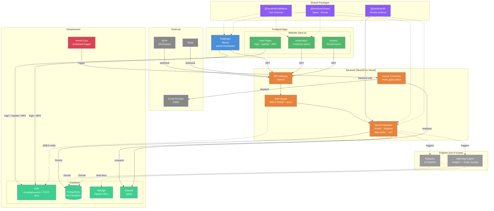

# BandiNet — System Diagram

**Legend:**

- **Blue** — Publicator (admin dashboard)
- **Green** — Website (Next.js) — auth pages + Matchator/Studio route groups
- **Orange** — Backend (NestJS on Vercel)
- **Red** — Vercel Cron (scheduled queue-consumer trigger)
- **Purple** — Shared packages
- **Gray** — External services
- **Dashed gray** — Engines (out of scope — Extractor & Matching)

**Key flows:**

- Auth (login/register/MFA) → **Website** handles all auth flows, calls **Supabase Auth directly**
- Matchator and Studio are route-group layouts under the same Next.js app, sharing auth
- Data operations → frontends send JWT to **Backend API**, backend validates via JWKS
- BOH → Backend webhook → Supabase Queue (pgmq) → Extractor → DB
- Extractor and Matching Engine are **out of scope** — shown as future integrations triggered by Backend
